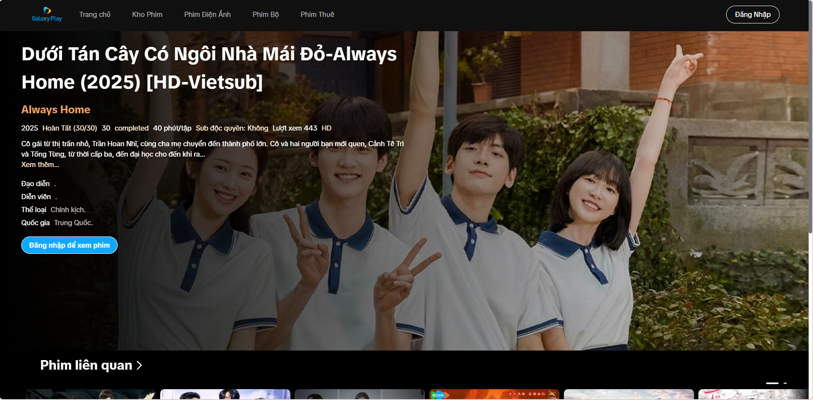
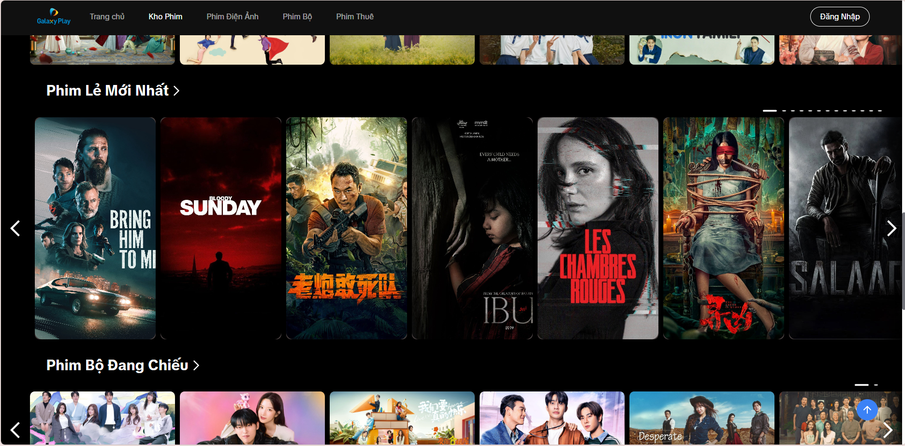
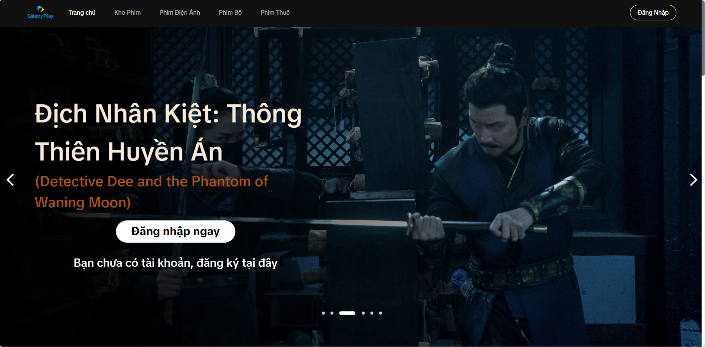

# 🎬 Dự Án Web Xem Phim Galaxy

Link youtube Demo: https://youtu.be/_DG37s3uKFw

🖼️ Giao diện  
Dưới đây là một số hình ảnh giao diện của ứng dụng:  




## 🚀 Giới Thiệu

Dự án web xem phim trực tuyến cho phép người dùng tìm kiếm, xem trailer, đánh giá và bình luận về các bộ phim. Hệ thống hỗ trợ đăng nhập, đăng ký, và lưu trữ lịch sử tìm kiếm để mang lại trải nghiệm tốt nhất cho người dùng.

## 🌟 Tính Năng Nổi Bật

-   📺 **Xem phim online**
-   🎞️ **Xem trailer của phim**
-   🔍 **Tìm kiếm và lọc phim theo từ khóa**
-   💬 **Bình luận và đánh giá phim**
-   🎞️ **Có thể sử dụng cho nhiều thiết bị khác nhau như ipad, điện thoại**

## 🛠️ Công Nghệ Sử Dụng

Dự án sử dụng nhiều công nghệ hiện đại để tối ưu hóa hiệu suất và trải nghiệm người dùng:

-   ⚛️ **React**: Thư viện JavaScript để xây dựng giao diện người dùng.
-   🌐 **Node.js**: Viết API quản lý tài khoản người dùng (đăng nhập, đăng xuất, đăng ký).
-   🗄️ **MongoDB**: Lưu trữ thông tin tài khoản, lịch sử tìm kiếm và bình luận.
-   🔑 **JWT Authentication**: Xác thực người dùng, lưu trạng thái đăng nhập với cookie.
-   ⚡ **Vite**: Công cụ phát triển nhanh với HMR (Hot Module Replacement).
-   🎨 **Tailwind CSS**: Xây dựng giao diện nhanh chóng với CSS utility-first (có tùy chỉnh CSS).
-   📦 **Redux**: Quản lý trạng thái toàn cục hiệu quả.
-   🎥 **React Player**: Tích hợp trình phát trailer phim.
-   📸 **Swiper**: Tạo slideshow cho poster phim.
-   🖼️ **React Lazy Load Image Component**: Tối ưu hiệu suất tải ảnh.
-   ⏳ **React-loading Skeleton**: Hiệu ứng loading mượt mà.
-   📺 **@vidstack/react**: Hỗ trợ phát video chất lượng cao.
-   🏷️ **Tippy.js**: Tạo tooltip chuyên nghiệp.
-   🛠 **Shadcn**: Sử dụng một số component UI từ thư viện này.

## 📡 Nguồn Dữ Liệu Phim

Dữ liệu phim được lấy từ API của [OPhim](https://forum.ophim.cc/d/27api-postman-ophim-otruyen).

## 🔌 Plugin Phát Triển

Dự án sử dụng `@vitejs/plugin-react` để hỗ trợ Fast Refresh thông qua Babel.

## 📜 Cài Đặt & Chạy Dự Án

### Yêu Cầu

-   Node.js
-   Git
-   MongoDB

### Cài Đặt

```bash
# Clone repo
git clone https://github.com/ductai2009/fullstack_web_movie.git

# Cài đặt dependencies
cd fullstack_web_movie
npm install
```

### Cấu hình MongoDB

Cập nhật MONGODB_URI trong file .env để cấu hình MongoDB cho dự án

### Chạy Dự Án

```bash
# Chạy server backend
npm run dev

cd frontend
npm install
# Chạy frontend
npm run dev
```

## 📩 Đóng Góp

Mọi đóng góp và cải tiến cho dự án đều được hoan nghênh! Hãy tạo Pull Request hoặc Issues để trao đổi.

---

🚀 Chúc bạn có trải nghiệm tuyệt vời với dự án xem phim này! 🍿
